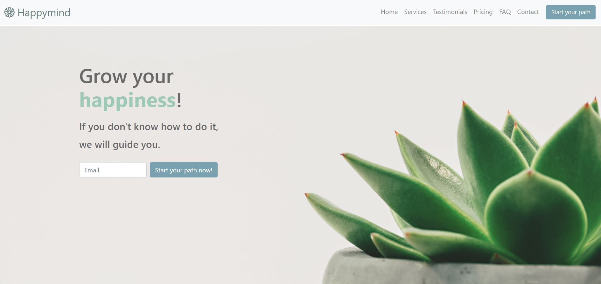

# Landing Page

This is an example of a landing page that I wanted to create to consolidate my front-end knowledge. I decided to set up the work this way:
- the topic
- the choice of the color palette
- define the structure and layout of the page
- writing the textual content

# Demo GIF

# Technologies
For the realization of the project was used:
- **HTML**: to create the structure and content of the page.
- **CSS** and **Bootstrap**: to define the style and organization of the layout.

# Responsive Page
The graphic below shows the responsiveness of the page for desktop, tablet and smartphone respectively.

